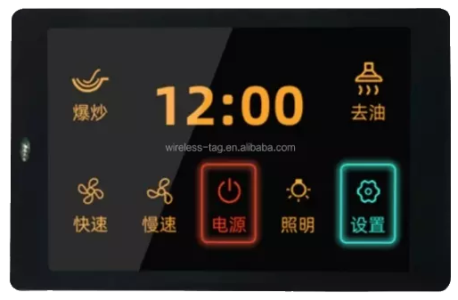
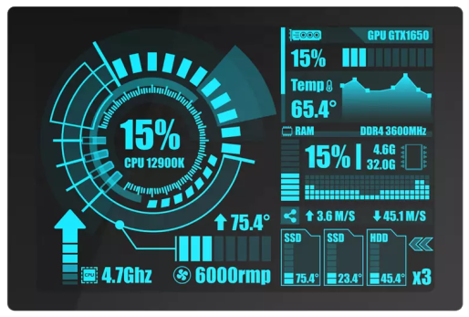

## Web Installer : [https://iot.sukesh.me](https://iot.sukesh.me)

## ESP32-TUX - A Touch UX template to get you started.  
- Currently Supported Devices : [WT32-SC01](https://www.alibaba.com/product-detail/WT32-SC01-3-5-3-5inch_1600120762835.html?spm=a2747.product_upgrade.0.0.636971d29EHKiD) / [WT32-SC01 Plus](https://www.alibaba.com/product-detail/Upgrade-WT32-SC01-plus-16MB-hmi_1600609718238.html?spm=a2756.order-detail-ta-bn-s.0.0.6f3f2fc2RYpL8H)
- Graphics & Touch Driver : [LovyanGFX](https://github.com/lovyan03/LovyanGFX)
- UI / Widgets : [LVGL9.x](https://github.com/lvgl/lvgl)
- Framework : [ESP-IDF](https://github.com/espressif/esp-idf/)


## Key Project Goals
- UI Scaling for different resolutions
- Rotate to Landscape / Portrait without code changes
- Easy re-use of the template with just a header file [Supported Devices here](/main/devices/)
- Switching Themes easily (Dark/Light)
- Access to SPIFF (FAT once upgraded to IDF 5.x) partition with F:/\<filename>
- Support for updating UI from any Task
- Wi-Fi Provisioning using BLE/SoftAP
- OTA update using local (Python webserver) and Cloud (Azure)
- Save settings in json file
- Support more devices with TFT + Capacitive Touch

## Features included 
- [x] Support for updating UI from different tasks [lvgl_acquire/lvgl_release]
- [x] UI code separation into [gui.hpp](/main/gui.hpp)
- [x] Same UI code which adapts to different resolutions
- [x] Supports shared SPI bus for SD Card - [here](/main/helper_storage.hpp)
- [x] Instructions below on how to compile and use same project target different ESP32 / ESP32-S3 controllers.
- [x] Switch between devices using just a header file inclusion 
- [x] Add your own controller/display with just a header change 
- [x] Shows battery meter animation using timer - [here](/main/main.cpp)
- [x] Shows SD card status change with icon
- [x] Switch theme between Light & Dark - [here](/main/gui.hpp)
- [x] Scrolling long message in footer - [here](/main/gui.hpp)
- [x] Rotate screen Landscape/Portrait [here](/main/main.cpp)
- [x] Enable SPIFF partition and init [here](/main/helpers/helper_spiff.hpp)
- [x] Map SPIFF to LVGL Filesystem as F: [here](/main/helpers/helper_lv_fs.hpp)
- [x] Load Images directly using F:/<filename>.png [here => tux_panel_weather()](/main/gui.hpp)

- [x] Settings Page
- [x] UI Islands (Widget - tux_panel)

### Todo List
- [ ] Wi-Fi Config 
- [ ] OTA Update 
- [ ] BLE Config 
- [ ] Pages as modules
- [ ] Multiple Navigation styles
- [ ] Integration with SquareLine Studio

## Currently Supported Devices 
> [Wireless Tag WT32-SC01 (ESP32 + 3.5" TFT with Capacitive Touch)](https://www.alibaba.com/product-detail/esp32-development-board-WT32-SC01-3_62534911683.html) 

  

> [Wireless Tag WT32-SC01 Plus (ESP32-S3 + 3.5" TFT with Capacitive Touch + SD Card)](https://www.alibaba.com/product-detail/Good-heat-dissipation-IPS-LCD-Color_1600148110318.html) 




## Get Started
> Git clone and recursively update submodule
```cmake
# Clone repo and update submodules (LovyanGFX + LVGL)
git clone https://github.com/sukesh-ak/ESP32-TUX.git
cd ESP32-TUX
git submodule update --init --recursive

# Update submodules to the latest if required (LovyanGFX + LVGL)
# git submodule foreach git pull
```

## Separate build folder for ESP32 & ESP32-S3
> Check settings in CMakeLists.txt [here](CMakeLists.txt#L8)
#### WT32-SC01 - ESP32
```cmake
# set target and build,flash,monitor
idf.py -B build-esp32 set-target esp32 build
idf.py -B build-esp32 -p COM6 flash monitor
```

#### WT32-SC01 Plus - ESP32-S3
```cmake
# set target and build,flash,monitor
idf.py -B build-esp32s3 set-target esp32s3 build
idf.py -B build-esp32s3 -p COM3 app-flash monitor
```

## Setup custom lvgl config - ESP-IDF  
> Check settings in CMakeLists.txt [here](CMakeLists.txt#L16)
```cmake
#LVGL custom config file setup
idf_build_set_property(COMPILE_OPTIONS "-DLV_CONF_INCLUDE_SIMPLE=1" APPEND)
idf_build_set_property(COMPILE_OPTIONS "-I../main" APPEND)
```

## Display Compile Time Information
Check settings in CMakeLists.txt [here](CMakeLists.txt#L25)  
```cmake
# Display Compile Time Information
message(STATUS "--------------Compile Info------------")
message(STATUS "IDF_PATH = ${IDF_PATH}")
message(STATUS "IDF_TARGET = ${IDF_TARGET}")
message(STATUS "PROJECT_NAME = ${PROJECT_NAME}")
message(STATUS "PROJECT_DIR = ${PROJECT_DIR}")
message(STATUS "BUILD_DIR = ${BUILD_DIR}")
message(STATUS "SDKCONFIG = ${SDKCONFIG}")
message(STATUS "SDKCONFIG_DEFAULTS = ${SDKCONFIG_DEFAULTS}")
message(STATUS "CONFIG_LV_CONF_SKIP = ${CONFIG_LV_CONF_SKIP}")
message(STATUS "COMPILE_OPTIONS = ${COMPILE_OPTIONS}")
message(STATUS "---------------------------------------")
message(STATUS "CMAKE_SOURCE_DIR = ${CMAKE_SOURCE_DIR}")
message(STATUS "CMAKE_BINARY_DIR = ${CMAKE_BINARY_DIR}")
message(STATUS "---------------------------------------")
```
## 3D Printable enclosure (STL)  
[FREE - WT32-SC01 - 3D enclosure on SketchFab website](https://sketchfab.com/3d-models/wt32-sc01-case-cfec05638de540b0acccff2091508500)  
[FREE - WT32-SC01 - 3D enclosure on Cults3d by DUANEORTON](https://cults3d.com/en/3d-model/tool/desk-enclosure-for-wt32-sc01)  
[PAID - WT32-SC01 - 3D enclosure on Cults3d by PRINTMINION](https://cults3d.com/en/design-collections/printminion/various-cases-for-wt32-sc01-by-wireless-tag)  
[PAID - WT32-SC01 - 3D enclosure on Cults3d by TOMCASA](https://cults3d.com/en/3d-model/gadget/boite-pour-wt32-sc01-esp32-tft-tactile)

