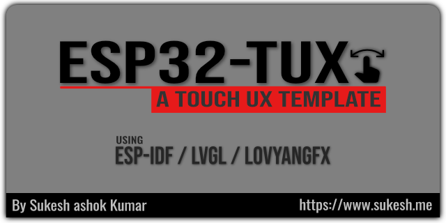
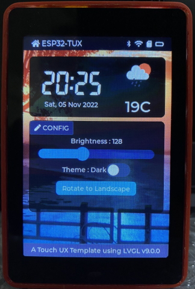
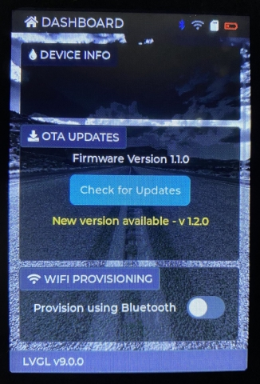

  

 
[](https://github.com/sponsors/sukesh-ak)   
 
 
 

## ESP32-TUX - A Touch UX template to get you started.  
- Currently Supported Devices : 
  - [WT32-SC01 - SPI TFT 3.5" ST7796 - ESP32](https://bit.ly/wt32-sc01) 
  - [WT32-SC01 Plus 8Bit Parallel 3.5" ST7796UI - ESP32-S3](https://bit.ly/wt32-sc01-plus)
  - [Makerfabs 16Bit Parallel TFT 3.5" ILI9488 - ESP32-S3](https://bit.ly/ESP32S335D)
  - [Makerfabs SPI TFT 3.5" ILI9488 - ESP32-S3](https://bit.ly/ESP32S3SPI35)
- Graphics & Touch Driver : [LovyanGFX](https://github.com/lovyan03/LovyanGFX)
- UI / Widgets : [LVGL9.x](https://github.com/lvgl/lvgl)
- Framework : [ESP-IDF](https://github.com/espressif/esp-idf/)




## Web Installer : [https://tux.sukesh.me](https://tux.sukesh.me)
> You only need a USB Cable and Browser to install and test on your device.

## Key Project Goals
- An easy UI Template to get started quickly
- UI Scaling for different resolutions
- Rotate to Landscape / Portrait without code changes
- Easy re-use of the template with just a header file [Supported Devices here](/main/devices/)
- Switching Themes easily (Dark/Light)
- Access to SPIFF (FAT once upgraded to IDF 5.x) partition with F:/\<filename>
- Support for updating UI from any Task
- Wi-Fi Provisioning using BLE/SoftAP
- OTA update using local (Python webserver) and Cloud (Azure)
- Save settings in json file
- Support more devices with TFT + Capacitive Touch

## Features included 
- [x] OTA Update with esp_events integration
- [x] Wi-Fi Provisioning using SoftAP + Espressif Provisioning App
- [x] UI Islands (Widget - tux_panel)
- [x] Support for updating UI from different tasks [lvgl_acquire/lvgl_release]
- [x] UI code separation into [gui.hpp](/main/gui.hpp)
- [x] Same UI code which adapts to different resolutions
- [x] Supports shared SPI bus for SD Card - [here](/main/helper_storage.hpp)
- [x] Instructions below on how to compile and use same project target different ESP32 / ESP32-S3 controllers.
- [x] Switch between devices using just a header file inclusion 
- [x] Add your own controller/display with just a header change 
- [x] Shows battery meter animation using timer - [here](/main/main.cpp)
- [x] Shows SD card status change with icon
- [x] Switch theme between Light & Dark - [here](/main/gui.hpp)
- [x] Scrolling long message in footer - [here](/main/gui.hpp)
- [x] Rotate screen Landscape/Portrait [here](/main/main.cpp)
- [x] Enable SPIFF partition and init [here](/main/helpers/helper_spiff.hpp)
- [x] Map SPIFF to LVGL Filesystem as F: [here](/main/helpers/helper_lv_fs.hpp)
- [x] Map SD Card to LVGL Filesystem as S: [here](/main/helpers/helper_lv_fs.hpp)
- [x] Load Images directly using F:/<filename>.png [here => tux_panel_weather()](/main/gui.hpp)
- [x] Settings Page

### Todo List
- [ ] BLE Config 
- [ ] Pages as modules
- [ ] Multiple Navigation styles
- [ ] Integration with SquareLine Studio  

## WIDGET : How to use TUX_PANEL Widget
> Entire UI consists of Header, Footer and TUX_PANEL widgets.

```c++
// Create the Panel instance with title 
// 200px height and it can also be LV_SIZE_CONTENT or LV_PCT(100)
// Leave title empty if you don't need a title.
lv_obj_t *panel1 = tux_panel_create(parent, LV_SYMBOL_EDIT " CONFIG", 200);

// Set the common panel style
lv_obj_add_style(panel1, &style_ui_island, 0);

// Set title color to RED
tux_panel_set_title_color(panel1, lv_palette_main(LV_PALETTE_RED));

// Set title background color to BLUE
tux_panel_set_title_bg_color(panel1,lv_palette_main(LV_PALETTE_BLUE))

// Set height of tux_panel to 300
tux_panel_set_height(panel1,300);

// Set background color of content area to GREEN
tux_panel_set_content_bg_color(panel1,lv_palette_main(LV_PALETTE_GREEN))

// Get Content Area of the panel to add UI elements
lv_obj_t *cont1 = tux_panel_get_content(panel1);

    // Add Label to the content area
    lv_obj_t *lbl_version = lv_label_create(cont1);
    lv_obj_set_size(lbl_version, LV_SIZE_CONTENT, 30);
    lv_obj_align(lbl_version, LV_ALIGN_CENTER, 0, 0);
    lv_label_set_text(lbl_version, "Firmware Version 1.1.0");
```

## Currently Supported Devices 

| Devices   | WT32-SC01  | WT32-SC01+ | ESP32S335D | ESP32S3SPI35
|:---------  |:-----------:|:----------:|:--------:|:-----------:
|Manufacturer|Wireless-Tag|Wireless-Tag|Makerfabs|Makerfabs
|Controller   |ESP32|ESP32-S3   |ESP32-S3    | ESP32-S3
|Display Size | 3.5" |3.5"  |3.5"  |3.5" 
|Resolution|480x320|480x320|480x320|480x320
|Display Controller|ST7796|ST7796UI|ILI9488|ILI9488
|Display Interface|SPI|8Bit Parallel|SPI|16Bit Parallel
|Touch Controller|FT5x06|FT5x06|FT5x06|FT5x06
|Flash Size |4MB|8MB|16MB|16MB
|PSRAM Size |4MB|2MB|2MB|2MB
|Wi-Fi|Yes|Yes|Yes|Yes
|Bluetooth|BT/BLE 4.x|BLE 5.x|BLE 5.x|BLE 5.x
|SD CARD |No|Yes|Yes|Yes
|OTG |No|Yes|Yes|Yes
|Datasheet|[PDF](datasheet/WT32-SC01_ESP32.pdf)|[PDF](datasheet/WT32-SC01_Plus_ESP32-S3.pdf)|[PDF](datasheet/Makerfabs-ESP32S3SPI35.PDF)|[PDF](datasheet/Makerfabs-ESP32S335D.pdf)
|Purchase Link|[BUY](https://bit.ly/wt32-sc01)|[BUY](https://bit.ly/wt32-sc01-plus)|[BUY](https://bit.ly/ESP32S335D)|[BUY](https://bit.ly/ESP32S3SPI35)
> Flash & PSRAM specifications are as per what I received.


## Get Started
> Git clone and recursively update submodule
```cmake
# Clone repo and update submodules (LovyanGFX + LVGL) recursively
git clone --recursive https://github.com/sukesh-ak/ESP32-TUX.git
cd ESP32-TUX
```

## Separate build folder for ESP32 & ESP32-S3
> Check settings in CMakeLists.txt [here](CMakeLists.txt#L8)  
> This enables you to have separate build folder, in case you use multiple devices with different controllers.  

#### ESP32 devices
```cmake
# set IDF chip target (default is 'esp32')
idf.py set-target esp32s3

# set target and build,flash,monitor
idf.py build

# Compile, Flash and Monitor
idf.py -p COM6 flash monitor
```

## How custom lvgl config is setup - ESP-IDF  
> Check settings in CMakeLists.txt [here](CMakeLists.txt#L16)
```cmake
#LVGL custom config file setup
idf_build_set_property(COMPILE_OPTIONS "-DLV_CONF_INCLUDE_SIMPLE=1" APPEND)
idf_build_set_property(COMPILE_OPTIONS "-I../main" APPEND)
```

## Display Helpful Compile Time Information
> Check settings in CMakeLists.txt [here](CMakeLists.txt#L25)  
```cmake
# Display Compile Time Information
message(STATUS "--------------Compile Info------------")
message(STATUS "IDF_PATH = ${IDF_PATH}")
message(STATUS "IDF_TARGET = ${IDF_TARGET}")
message(STATUS "PROJECT_NAME = ${PROJECT_NAME}")
message(STATUS "PROJECT_DIR = ${PROJECT_DIR}")
message(STATUS "BUILD_DIR = ${BUILD_DIR}")
message(STATUS "SDKCONFIG = ${SDKCONFIG}")
message(STATUS "SDKCONFIG_DEFAULTS = ${SDKCONFIG_DEFAULTS}")
message(STATUS "CONFIG_LV_CONF_SKIP = ${CONFIG_LV_CONF_SKIP}")
message(STATUS "COMPILE_OPTIONS = ${COMPILE_OPTIONS}")
message(STATUS "---------------------------------------")
message(STATUS "CMAKE_SOURCE_DIR = ${CMAKE_SOURCE_DIR}")
message(STATUS "CMAKE_BINARY_DIR = ${CMAKE_BINARY_DIR}")
message(STATUS "---------------------------------------")
```
## 3D Printable enclosure (STL)  
[FREE - WT32-SC01 - 3D enclosure on SketchFab website](https://sketchfab.com/3d-models/wt32-sc01-case-cfec05638de540b0acccff2091508500)  
[FREE - WT32-SC01 - 3D enclosure on Cults3d by DUANEORTON](https://cults3d.com/en/3d-model/tool/desk-enclosure-for-wt32-sc01)  
[PAID - WT32-SC01 - 3D enclosure on Cults3d by PRINTMINION](https://cults3d.com/en/design-collections/printminion/various-cases-for-wt32-sc01-by-wireless-tag)  
[PAID - WT32-SC01 - 3D enclosure on Cults3d by TOMCASA](https://cults3d.com/en/3d-model/gadget/boite-pour-wt32-sc01-esp32-tft-tactile)

